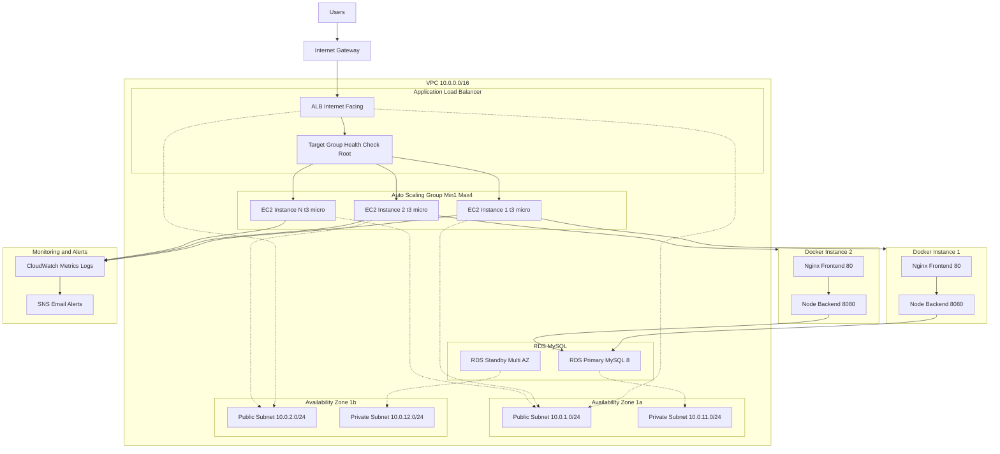

## 🏗️ Template Dependencies Flow

## 🔧 Component Communication Matrix

| Component | Communicates With | Protocol/Port | Purpose |
|-----------|-------------------|---------------|---------|
| 🌐 **Internet** | ALB | HTTP/80 | User requests |
| ⚖️ **ALB** | EC2 Instances | HTTP/80 | Load balancing |
| 🎯 **Target Group** | EC2 Instances | HTTP/80 | Health checks |
| 🖥️ **EC2 Instances** | RDS | MySQL/3306 | Database queries |
| 🐳 **nginx (Frontend)** | Node.js (Backend) | HTTP/8080 | API proxy |
| ⚙️ **Node.js (Backend)** | RDS MySQL | MySQL/3306 | Data persistence |
| 📊 **CloudWatch** | EC2 + ASG | CloudWatch API | Metrics collection |
| 📧 **SNS** | Email/SMS | SMTP/SMS | Alert notifications |

## 🛡️ Security Groups Summary

| Security Group | Resource | Inbound Rules | Purpose |
|----------------|----------|---------------|---------|
| **ALB-SG** | ALB | HTTP/80 from 0.0.0.0/0 | Public web access |
| **App-SG** | EC2 Instances | SSH/22, HTTP/80, HTTP/8080 from 0.0.0.0/0 | Instance access |
| **RDS-SG** | RDS | MySQL/3306 from VPC CIDR | Database access |
