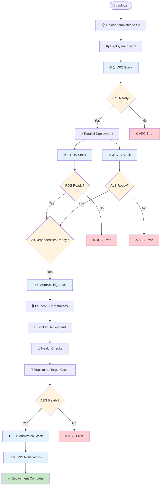

```mermaid
graph TB
    %% Usuarios y Internet
    Users[👥 Users] --> IGW[🌐 Internet Gateway]
    
    %% VPC Container
    subgraph VPC["🏗️ VPC (10.0.0.0/16)"]
        %% Availability Zones
        subgraph AZ1["🏢 Availability Zone 1a"]
            PubSub1[📡 Public Subnet<br/>10.0.1.0/24]
            PrivSub1[🔒 Private Subnet<br/>10.0.11.0/24]
        end
        
        subgraph AZ2["🏢 Availability Zone 1b"]  
            PubSub2[📡 Public Subnet<br/>10.0.2.0/24]
            PrivSub2[🔒 Private Subnet<br/>10.0.12.0/24]
        end
        
        %% ALB en subnets públicas
        subgraph ALB_Layer["⚖️ Application Load Balancer"]
            ALB[🔀 ALB<br/>internet-facing]
            TG[🎯 Target Group<br/>Health Check: /]
        end
        
        %% Auto Scaling Group
        subgraph ASG_Layer["🚀 Auto Scaling Group (Min:1, Max:4)"]
            EC2_1[🖥️ EC2 Instance 1<br/>t3.micro]
            EC2_2[🖥️ EC2 Instance 2<br/>t3.micro] 
            EC2_3[🖥️ EC2 Instance N<br/>t3.micro]
        end
        
        %% RDS en subnets privadas
        subgraph RDS_Layer["🗄️ RDS MySQL"]
            RDS_Primary[🗃️ Primary<br/>MySQL 8.0]
            RDS_Standby[🗃️ Standby<br/>Multi-AZ]
        end
    end
    
    %% Docker Containers en cada instancia
    subgraph Docker1["🐳 Docker (Instance 1)"]
        Frontend1[🌐 nginx:80<br/>Frontend]
        Backend1[⚙️ Node.js:8080<br/>Backend API]
    end
    
    subgraph Docker2["🐳 Docker (Instance 2)"]
        Frontend2[🌐 nginx:80<br/>Frontend]
        Backend2[⚙️ Node.js:8080<br/>Backend API]
    end
    
    %% CloudWatch & Monitoring
    subgraph Monitoring["📊 Monitoring & Alerts"]
        CW[📊 CloudWatch<br/>Metrics & Logs]
        SNS[📧 SNS<br/>Email Alerts]
    end
    
    %% Conexiones principales
    IGW --> ALB
    ALB --> TG
    TG --> EC2_1
    TG --> EC2_2
    TG --> EC2_3
    
    %% Colocación en subnets
    ALB -.-> PubSub1
    ALB -.-> PubSub2
    EC2_1 -.-> PubSub1
    EC2_2 -.-> PubSub2
    EC2_3 -.-> PubSub1
    RDS_Primary -.-> PrivSub1
    RDS_Standby -.-> PrivSub2
    
    %% Docker containers
    EC2_1 --> Docker1
    EC2_2 --> Docker2
    Frontend1 --> Backend1
    Frontend2 --> Backend2
    
    %% Database connections
    Backend1 --> RDS_Primary
    Backend2 --> RDS_Primary
    
    %% Monitoring connections
    EC2_1 --> CW
    EC2_2 --> CW
    EC2_3 --> CW
    CW --> SNS
    
    %% Estilos
    classDef vpc fill:#e1f5fe
    classDef public fill:#c8e6c9
    classDef private fill:#ffcdd2
    classDef compute fill:#fff3e0
    classDef database fill:#f3e5f5
    classDef network fill:#e8f5e8
    classDef docker fill:#e3f2fd
    
    class VPC vpc
    class PubSub1,PubSub2 public
    class PrivSub1,PrivSub2 private
    class EC2_1,EC2_2,EC2_3 compute
    class RDS_Primary,RDS_Standby database
    class ALB,TG,IGW network
    class Docker1,Docker2,Frontend1,Frontend2,Backend1,Backend2 docker
```

## 🏗️ Template Dependencies Flow



## 🔧 Component Communication Matrix

| Component | Communicates With | Protocol/Port | Purpose |
|-----------|-------------------|---------------|---------|
| 🌐 **Internet** | ALB | HTTP/80 | User requests |
| ⚖️ **ALB** | EC2 Instances | HTTP/80 | Load balancing |
| 🎯 **Target Group** | EC2 Instances | HTTP/80 | Health checks |
| 🖥️ **EC2 Instances** | RDS | MySQL/3306 | Database queries |
| 🐳 **nginx (Frontend)** | Node.js (Backend) | HTTP/8080 | API proxy |
| ⚙️ **Node.js (Backend)** | RDS MySQL | MySQL/3306 | Data persistence |
| 📊 **CloudWatch** | EC2 + ASG | CloudWatch API | Metrics collection |
| 📧 **SNS** | Email/SMS | SMTP/SMS | Alert notifications |

## 🛡️ Security Groups Summary

| Security Group | Resource | Inbound Rules | Purpose |
|----------------|----------|---------------|---------|
| **ALB-SG** | ALB | HTTP/80 from 0.0.0.0/0 | Public web access |
| **App-SG** | EC2 Instances | SSH/22, HTTP/80, HTTP/8080 from 0.0.0.0/0 | Instance access |
| **RDS-SG** | RDS | MySQL/3306 from VPC CIDR | Database access |